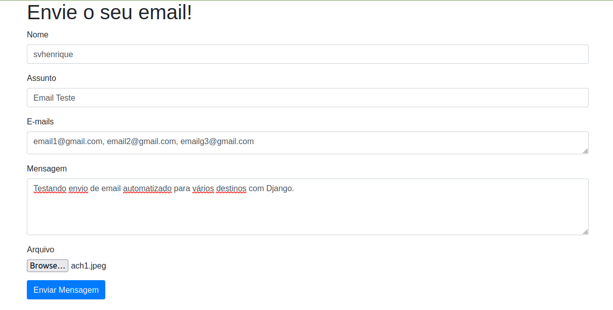

## Sobre
Projeto para o envio de mensagens automatizadas para emails com django

## Imagens do projeto



## Configuração do ambiente 

### Clonando repositório

Para clonar o repositório é possível baixa-lo completamente do github e extrair em uma pasta de projeto ou utilizar o comando:

```bash
https://github.com/svhenrique/envio-email-automatico.git
```

Para utilizar o comando anterior é necessário ter o Git instalado no computador.

### Configurando ambiente 

É necessária a instalação da linguagem Python. É possível baixa-la aqui:

- https://www.python.org/downloads/

Passo a passo da instalação da linguagem pode ser encontrado aqui:

- https://wiki.python.org/moin/BeginnersGuide/Download

É recomendável que se use um ambiente virtual para utilização da aplicação. Mas antes, é preciso baixar a biblioteca virtualenv e para fazer isso, basta executar o comando:


```bash
pip install virtualenv
```

Para criar um ambiente virtual no python, fazemos:

```bash
virtualenv venv
```

Após criar o ambiente virtual, se você estiver no prompt de comando (shell, terminal, cmd, etc), é preciso ativar o venv (ambiente virtual) criado, para isso utilizamos o comando:

```bash
venv/bin/activate
```
## Instalando dependências

Para instalar dependências, basta usar o comando:

```bash
pip install -r requirements.txt
```

## Configurando sistema

É necessário um email Google com o "Less secure apps" ativado, podendo
ser ativado com o seguinte tutorial: 

https://www.youtube.com/watch?v=Ee7PDsbfOUI

Após isso, coloca-se o email e a senha no env do projeto.

## Iniciando o programa

Para iniciar a aplicação, basta executar:

```bash
python manage.py runserver
```


